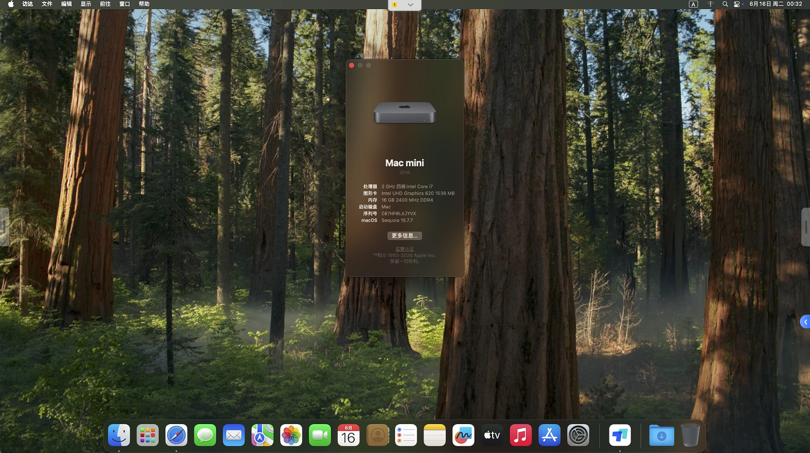

# 🖥️ 迷你主机 (i7-8565U / UHD 620) Hackintosh OpenCore EFI

  

适用于 Intel Core i7-8565U (Whiskey Lake-U) + UHD 620 迷你主机的黑苹果 OpenCore EFI 配置。

> 主板信息为通用 OEM（DEFAULT DEFAULT STRING），可能适用于多种品牌（如 GMK NucBox、MOREFINE、BOSGAME 等白牌迷你主机），请根据实际硬件确认兼容性。

## 硬件配置

| 组件 | 型号 | 驱动情况 |
|------|------|:--------:|
| 主板 | DEFAULT DEFAULT STRING (Cannon Point-LP) | ✅ |
| CPU | Intel Core i7-8565U (Whiskey Lake-U, 4C/8T) | ✅ 睿频正常 |
| 核显 | Intel UHD Graphics 620 (Device ID: 8086-3EA0) | ✅ 硬件加速正常 |
| 声卡 | Realtek ALC269 (layout-id: 21) | ✅ 输入输出正常 |
| 有线网卡 | Realtek RTL8111 | ✅ |
| 无线网卡 | ~~Realtek 8821CE~~ | ❌ SSDT 屏蔽 |
| 蓝牙 | ~~Realtek Bluetooth (13D3-3533)~~ | ❌ |
| 硬盘 | ShiJi 512GB SATA | ✅ |
| 内存 | 依据具体机型 | ✅ |
| 显示器 | HDMI 1920×1080 | ✅ |

## BIOS 设置

| 选项 | 设置 |
|------|:----:|
| BIOS 版本 | 5.13 (2020-03-18) |
| SATA Operation | AHCI |
| Secure Boot | Disabled |
| UEFI Boot | Enabled |
| VT-d | Disabled (或开启并勾选 Kernel → DisableIoMapper) |
| CFG Lock | Unlocked |
| DVMT Pre-Allocated | 64MB+ |

## 配置详情

### SMBIOS

| 项目 | 值 |
|------|:---:|
| 机型 | Macmini8,1 |
| AAPL,ig-platform-id | 00009B3E |
| framebuffer-stolenmem | 00003001 (48MB) |
| framebuffer-fbmem | 00009000 |
| boot-args | `-v debug=0x100 keepsyms=1 -igfxblt` |

> `-igfxblt` 用于解决 UHD 620 背光问题。请自行生成三码（SMBIOS），不要直接使用本仓库的序列号。

### Kexts

| Kext | 版本 | 说明 |
|------|:---:|:----:|
| [Lilu.kext](https://github.com/acidanthera/Lilu) | v1.7.3 | 内核扩展注入框架 |
| [VirtualSMC.kext](https://github.com/acidanthera/VirtualSMC) | v1.3.8 | SMC 模拟 |
| [WhateverGreen.kext](https://github.com/acidanthera/WhateverGreen) | v1.7.1 | 显卡补丁 |
| [AppleALC.kext](https://github.com/acidanthera/AppleALC) | v1.9.8 | 声卡驱动 (layout 21) |
| [RealtekRTL8111.kext](https://github.com/RehabMan/OS-X-Realtek-Network) | v2.4.2 | 有线网卡驱动 |
| [BrightnessKeys.kext](https://github.com/acidanthera/BrightnessKeys) | v1.0.4 | 亮度按键支持 |
| [ECEnabler.kext](https://github.com/1Revenger1/ECEnabler) | v1.0.6 | 嵌入式控制器读取 |
| [RestrictEvents.kext](https://github.com/acidanthera/RestrictEvents) | v1.1.7 | 事件限制 |
| [SMCBatteryManager.kext](https://github.com/acidanthera/VirtualSMC) | v1.3.8 | 电池传感器 |
| [SMCLightSensor.kext](https://github.com/acidanthera/VirtualSMC) | v1.3.8 | 环境光传感器 |
| [SMCProcessor.kext](https://github.com/acidanthera/VirtualSMC) | v1.3.8 | CPU 传感器 |
| [SMCSuperIO.kext](https://github.com/acidanthera/VirtualSMC) | v1.3.8 | 风扇/温度传感器 |
| [USBToolBox.kext](https://github.com/USBToolBox/tool) | v1.2.0 | USB 工具盒 |
| [UTBMap.kext](https://github.com/USBToolBox/tool) | v1.1 | USB 定制映射 |
| [XHCI-unsupported.kext](https://github.com/RehabMan/OS-X-USB-Inject-All) | v0.9.2 | XHCI 控制器兼容性 |

### ACPI 热补丁 (SSDT)

| SSDT | 功能 |
|:----|:----:|
| SSDT-EC.aml | 仿冒嵌入式控制器 |
| SSDT-PLUG.aml | XCPM 电源管理插件 |
| SSDT-PMC.aml | NVRAM PMC 补丁 |
| SSDT-HPET.aml | HPET IRQ 修复 |
| SSDT-RTCAWAC.aml | RTC AWAC 兼容性修复 |
| SSDT-Disable_Network_RP08.aml | 屏蔽板载 Realtek 无线网卡 |

### Drivers

| Driver | 说明 |
|:-------|:----:|
| HfsPlus.efi | HFS+ 文件系统支持 |
| OpenRuntime.efi | OpenCore 运行时环境 |
| OpenCanopy.efi | 图形引导界面 |
| ResetNvramEntry.efi | NVRAM 重置入口 |

## macOS 兼容性

| macOS 版本 | 状态 |
|:-----------|:----:|
| macOS Sequoia 15.x | ✅ 已测试 |
| macOS Sonoma 14.x | ✅ |
| macOS Ventura 13.x | ✅ |

## 正常工作

- [x] Intel UHD Graphics 620 硬件加速 / 视频编码解码
- [x] HDMI 视频输出 (1920×1080@60Hz)
- [x] 声卡输入输出 (3.5mm 接口)
- [x] 有线网卡 (Realtek RTL8111)
- [x] 睡眠 / 唤醒
- [x] CPU 睿频 / XCPM 电源管理
- [x] USB 2.0/3.0
- [x] NVRAM 读写
- [x] iMessage / FaceTime / iCloud (需三码)
- [x] App Store
- [x] 开机音效 (OpenCanopy GUI)
- [x] 亮度调节 (BrightnessKeys)
- [x] 电池状态
- [x] 风扇监控

## 不工作

- [ ] 板载 Realtek 8821CE 无线网卡 (硬件不支持 macOS)
- [ ] 板载 Realtek 蓝牙 (硬件不支持 macOS)

## USB 端口映射

USB 已通过 USBToolBox + UTBMap 定制映射。

## 致谢

- [Acidanthera](https://github.com/acidanthera) 开发维护 OpenCore 及核心驱动
- [Dortania](https://dortania.github.io/OpenCore-Install-Guide/) 提供详细的 OpenCore 安装指南
- [USBToolBox](https://github.com/USBToolBox/tool) USB 定制工具

---

## 📄 许可证

MIT License - 详见 [LICENSE](LICENSE)

> ⚠️ 本教程仅供学习和研究使用

